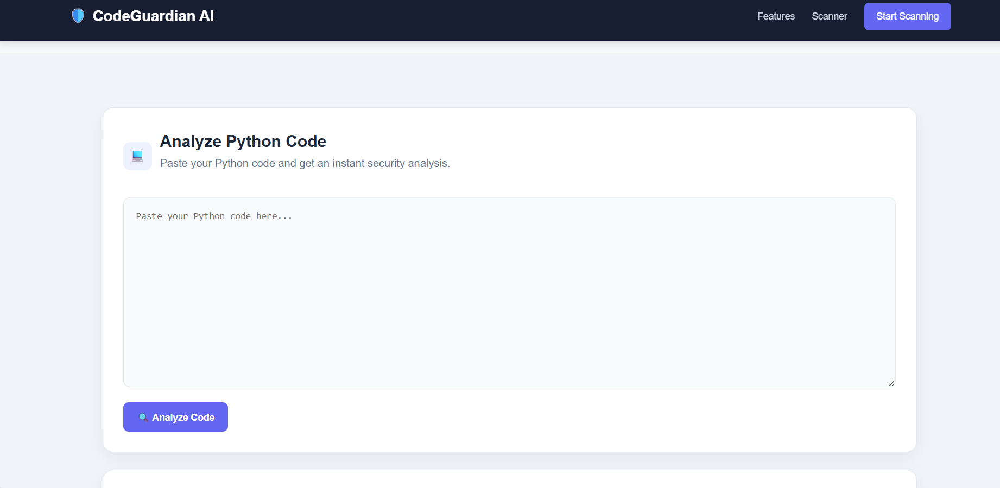
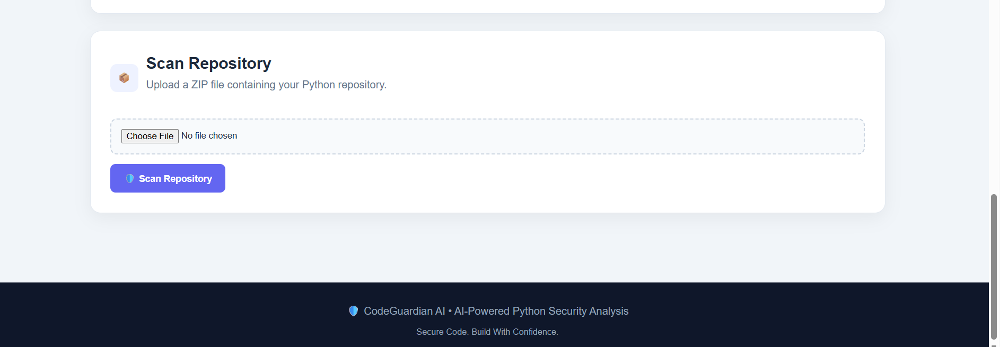
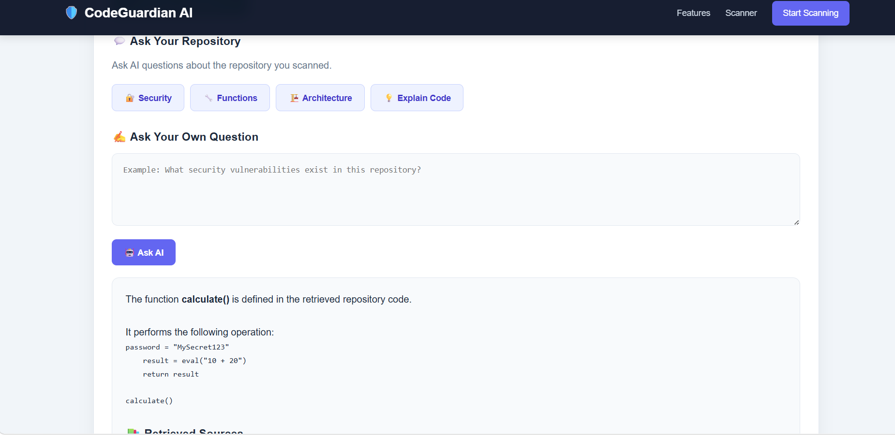
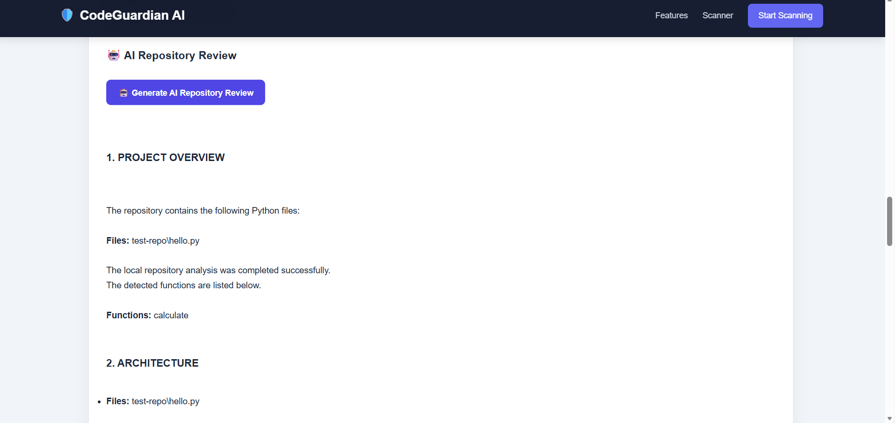

# 🛡️ CodeGuardian AI

### AI-Powered Python Code & Repository Security Reviewer

CodeGuardian AI is an intelligent security analysis platform that helps developers detect vulnerabilities, analyze Python repositories, generate AI-powered security reviews, and create safer versions of vulnerable code.

---

## 🚀 Features

- 🔍 Analyze Python code for syntax and security issues
- 📦 Scan complete Python repositories using ZIP uploads
- 🔐 Detect dangerous functions such as `eval()` and `exec()`
- 🚨 Identify possible hardcoded secrets and credentials
- 📊 Calculate repository security risk scores
- 🤖 Generate AI-powered repository security reviews
- 🔧 Automatically generate safer versions of vulnerable code
- 💬 Ask questions about scanned repositories
- 📚 Retrieve relevant source code for AI answers
- 🧠 Local fallback analysis when AI service is unavailable

---

## 🖥️ Screenshots

### 🏠 Homepage


### 🔍 Code Analysis



### 📦 Repository Scanner



### 🔐 Security Findings



### 🤖 AI Security Review



---

## 🏗️ Project Architecture

```text
Frontend (HTML / CSS / JavaScript)
              │
              ▼
        FastAPI Backend
              │
      ┌───────┼────────┐
      ▼       ▼        ▼
   Code     Security    AI
 Analyzer   Scanner   Services
      │       │        │
      └───────┼────────┘
              ▼
      Repository Analysis
              │
              ▼
        Security Report
```

---

## 📂 Project Structure

```text
codeguardian-ai/
│
├── app/
│   │
│   ├── ai/
│   │   ├── code_reviewer.py
│   │   ├── fix_generator.py
│   │   ├── repository_qa.py
│   │   └── repository_reviewer.py
│   │
│   ├── analysis/
│   │   ├── repository_scanner.py
│   │   └── security_scanner.py
│   │
│   ├── rag/
│   │   ├── rag_engine.py
│   │   └── vector_store.py
│   │
│   ├── rag_engine.py
│   └── main.py
│
├── frontend/
│   └── index.html
│
├── screenshots/
│   ├── homepage.png
│   ├── code_analysis.png
│   ├── Repository_scanner.png
│   ├── security_findings.png
│   └── ai_review.png
│
├── tests/
│
├── data/
│
├── .env
├── .gitignore
├── README.md
└── requirements.txt
```

---

## ⚙️ Installation

### 1. Clone the Repository

```bash
git clone https://github.com/011MANSI/codeguardian-ai.git
cd codeguardian-ai
```

### 2. Create a Virtual Environment

```bash
python -m venv venv
```

### 3. Activate the Virtual Environment

**Windows:**

```bash
venv\Scripts\activate
```

### 4. Install Dependencies

```bash
pip install -r requirements.txt
```

### 5. Configure Environment Variables

Create a `.env` file in the project root and add your API key:

```text
GEMINI_API_KEY=your_api_key_here
```

> ⚠️ Never upload your `.env` file or API keys to GitHub.

### 6. Run the Backend

```bash
uvicorn app.main:app --reload
```

The backend will start at:

```text
http://127.0.0.1:8000
```

Open API documentation:

```text
http://127.0.0.1:8000/docs
```

---

## 🔗 API Endpoints

| Method | Endpoint | Description |
|--------|----------|-------------|
| GET | `/` | API health check |
| POST | `/analyze` | Analyze Python code |
| POST | `/scan-repository` | Scan a Python repository |
| POST | `/review-repository` | Generate AI security review |
| POST | `/fix-repository` | Generate safer repository code |
| POST | `/ask-repository` | Ask questions about scanned repository |

---

## 🔐 Security Checks

CodeGuardian AI currently detects:

- Dangerous `eval()` usage
- Dangerous `exec()` usage
- Possible hardcoded passwords
- Possible API keys and secrets
- Security vulnerabilities
- Python syntax errors
- Repository-level security risks

---

## 🤖 AI Capabilities

CodeGuardian AI uses AI to:

- Explain security vulnerabilities
- Review repository architecture
- Suggest security improvements
- Generate safer code versions
- Answer questions about uploaded repositories
- Retrieve relevant source code context

If the AI service is temporarily unavailable, the application provides a **local fallback analysis engine**.

---

## 🛠️ Technology Stack

### Backend

- Python
- FastAPI
- Uvicorn

### Frontend

- HTML5
- CSS3
- JavaScript

### AI & Analysis

- Google Gemini API
- Static Code Analysis
- AST Parsing
- Repository Security Scanner
- RAG-based Repository Question Answering

---

## 🎯 Future Improvements

- Support for JavaScript and Java repositories
- Advanced vulnerability detection
- OWASP security mapping
- User authentication
- Scan history dashboard
- PDF security reports
- GitHub repository integration
- Docker deployment
- CI/CD security scanning
- Cloud deployment

---

## 💡 Project Motivation

Security vulnerabilities in source code can often remain unnoticed until deployment. CodeGuardian AI aims to help developers identify potential risks early in the development lifecycle.

The project combines static analysis, repository scanning, AI-powered explanations, automated code fixing, and repository question-answering into a single developer-friendly platform.

---

## 👩‍💻 Author

**Mansi**

Master's Student | Computer Science & Engineering

---

## ⭐ Why CodeGuardian AI?

CodeGuardian AI provides an integrated approach to Python code security by combining:

- 🔍 Static Code Analysis
- 🔐 Security Vulnerability Detection
- 📦 Repository-Level Scanning
- 🤖 AI-Powered Security Reviews
- 🔧 Automated Security Fixes
- 💬 Repository Question Answering
- 📚 Context-Based Source Retrieval

**Secure Code. Build With Confidence. 🛡️**

---

⭐ If you found this project useful, consider giving it a star!