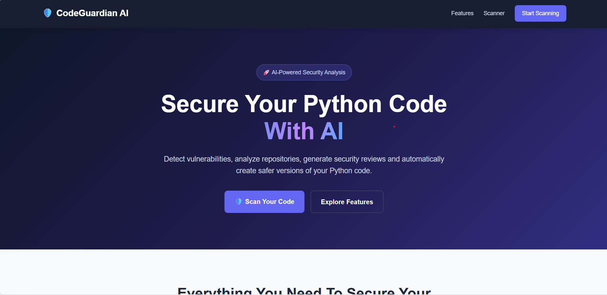

# 🛡️ CodeGuardian AI

### AI-Powered Python Code & Repository Security Reviewer

CodeGuardian AI is an intelligent security analysis platform that helps developers detect vulnerabilities, analyze Python repositories, generate AI-powered security reviews, and create safer versions of vulnerable code.

---

## 🚀 Features

- 🔍 Analyze Python code for syntax and security issues
- 📦 Scan complete Python repositories using ZIP uploads
- 🔐 Detect dangerous functions such as `eval()` and `exec()`
- 🚨 Identify possible hardcoded secrets and credentials
- 📊 Calculate repository security risk scores
- 🤖 Generate AI-powered repository security reviews
- 🔧 Automatically generate safer versions of vulnerable code
- 💬 Ask questions about scanned repositories
- 📚 Retrieve relevant source code for AI answers

---

## 🖥️ Screenshots

### 🏠 Homepage



### 🔍 Code Analysis


### 🔐 Repository Security Scan


### 🤖 AI Security Review


---

## 🏗️ Project Architecture

```text
Frontend (HTML/CSS/JavaScript)
            │
            ▼
       FastAPI Backend
            │
     ┌──────┼──────┐
     ▼      ▼      ▼
 Code    Security   AI
Analyzer Scanner  Service
     │      │      │
     └──────┼──────┘
            ▼
    Repository Analysis
            │
            ▼
      Security Report

📂 Project Structure
codeguardian-ai/
│
├── app/
│   ├── main.py                 # FastAPI application
│   ├── analyzer.py             # Python code analysis
│   ├── repository_scanner.py   # Repository scanning
│   ├── security_scanner.py     # Vulnerability detection
│   └── ai_service.py           # AI integration
│
├── frontend/
│   └── index.html              # Web interface
│
├── screenshots/                # Project screenshots
│
├── tests/                      # Test files
│
├── requirements.txt
├── README.md
├── .gitignore
└── LICENSE

⚙️ Installation
1. Clone the repository
git clone https://github.com/YOUR_USERNAME/codeguardian-ai.git
cd codeguardian-ai
2. Create a virtual environment
python -m venv venv
3. Activate the virtual environment

Windows:

venv\Scripts\activate
4. Install dependencies
pip install -r requirements.txt
5. Run the application
uvicorn app.main:app --reload

Backend will start at:

http://127.0.0.1:8000
🔗 API Endpoints
Method	Endpoint	Description
GET	/	API health check
POST	/analyze	Analyze Python code
POST	/scan-repository	Scan Python repository
POST	/review-repository	Generate AI security review
POST	/fix-repository	Generate safer repository
POST	/ask-repository	Ask questions about repository
🔐 Security Checks

CodeGuardian AI currently detects:

Dangerous eval() usage
Dangerous exec() usage
Hardcoded passwords
Hardcoded API keys
Potential security vulnerabilities
Python syntax errors
🛠️ Technology Stack

Backend

Python
FastAPI
Uvicorn

Frontend

HTML5
CSS3
JavaScript

AI

Google Gemini API
Local fallback analysis engine
🎯 Future Improvements
Support for JavaScript and Java repositories
Advanced vulnerability detection
OWASP security mapping
User authentication
Scan history dashboard
PDF security reports
GitHub repository integration
Docker deployment
CI/CD security scanning
👩‍💻 Author

Mansi

Master's Student | Computer Science & Engineering

⭐ Why CodeGuardian AI?

CodeGuardian AI combines static code analysis, repository scanning, security vulnerability detection, retrieval-based repository questioning, and AI-powered explanations into one developer-friendly platform.

The goal is to help developers understand security vulnerabilities and improve their code before deployment.

⭐ If you like this project, consider giving it a star!